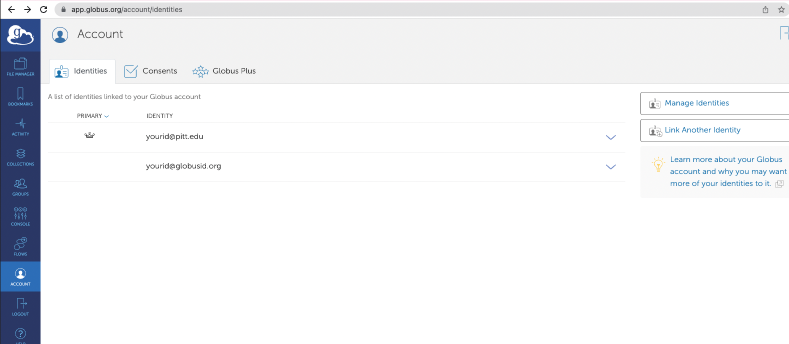

# Cypress Tests run with Circle CI

## Install
`npm i .`

## Run (tests before pushing to repo for Circle CI)
`npm start` # runs tests in complete Cypress GUI

OR
`npm run cli` # runs tests in terminal

## Docker 
```agsl
docker build -t portal_ui_ci .
docker run -p 8765:8765 -v $PWD:/portal_ui_ci portal_ui_ci
```

## Environment
`cp cypress.example.env.json cypress.env.json`
- Change the values of `token` and `session_displayname` to a valid Globus token and the respective user display name, usually the email.

### Authentication can also be set up with the following deprecated means.
- Change the values of `username` and `password` to that of your own Globus ID username and password respectively. Also set the `session_displayname`.
- You may need to create one [here](https://www.globusid.org/login).
- Then set up this new globus ID as an alias in your [globus.org account](https://app.globus.org/).
  - Sign in to your Globus Account
  - Click *Account* in the left vertical menu bar
  - Click *Link Another Identity*. Follow the onscreen steps 
  - You should be able to see your new identity listed in the *Identities* tab as `yourid@@globusid.org`



